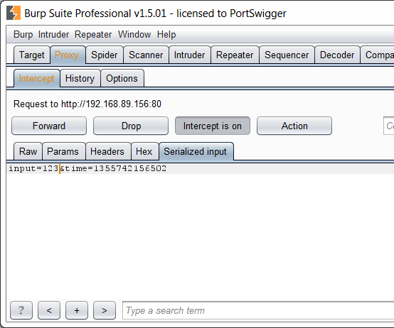

# Sample Burp Suite extension: custom editor tab

This extension demonstrates how you can extend Burp's own HTTP message editor
to handle the display and editing of unsupported data formats. This capability
can let you handle custom serialization implemented by specific applications,
or any other data format that Burp does not natively support.

In the past, some extensions have handled unsupported serialization formats by
hooking into Burp's HTTP stack, and modifying incoming and outgoing messages,
in order to unpack and repack the serialized data. Although this approach can
work, it is quite restricted in the type of data it can handle. And it is also
inelegant: it would be preferable to customize Burp to understand the custom
format itself, rather than tampering with the integrity of HTTP messages.

The [extender API](https://portswigger.net/burp/extender/) lets you add custom
tabs to Burp's HTTP message editor. When a message is about to be displayed,
Burp will ask the tab whether it can handle the message. If so, the custom tab
will be shown in the editor, and can support rendering and editing of the
message within its own UI:

The sample extension uses an artificially simple serialization format: the
serialized data is simply Base64-encoded within a request parameter. This
example was chosen so as to keep the code that handles the serialization as
simple as possible. But the format itself isn't the point: what matters is that
you can now easily extend Burp to understand any format that you may encounter
in a test.

As well as the new API for adding message editor tabs, this example also makes
use of Burp's new helper methods, to carry out common tasks such as parsing and
updating request parameters, encoding and decoding data in different formats,
and conversion of data between String and byte forms. 

This repository includes source code for Java, Python and Ruby. It also includes
a server (for ASP.NET and NodeJS) that encodes and decodes base64 data.

[Really astute testers might spot a deliberate vulnerability in the sample
server. More on that soon.]
